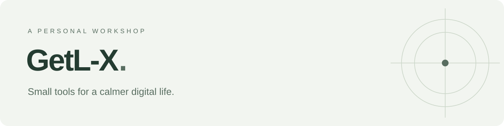
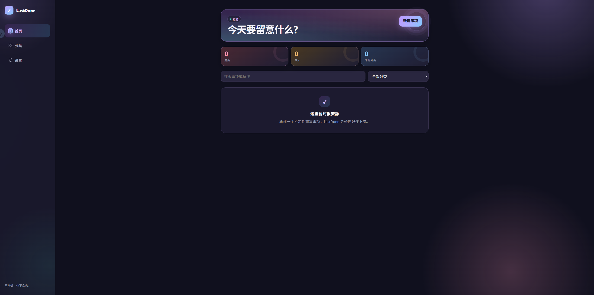
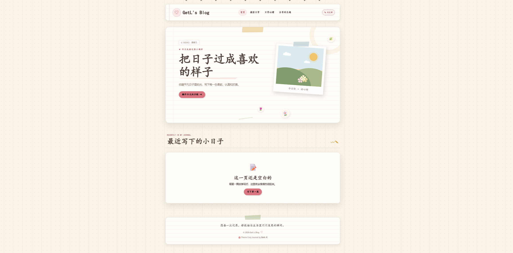
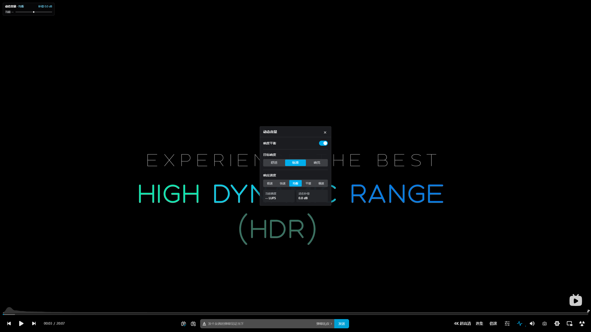

<picture>
  <source media="(prefers-color-scheme: dark)" srcset="assets/banner-dark.svg">
  
</picture>

做一些自己想用，也希望你会喜欢的小工具。

关注日常生活里的小需求，把它们做成简单、实用的作品。

### 精选作品 · Selected work

**[LastDone](https://github.com/getl-x/lastdone)** · 生活记录

上次是什么时候？下次该什么时候？记录容易忘记的周期事项，让日常维护有迹可循。

离线优先 · 周期提醒 · 自托管

 

**[Cozy Journal](https://github.com/getl-x/cozy-journal)** · 写作空间

一个日记风格的 WordPress 主题，为文字、日常和自己的表达留一点空间。

WordPress · 自定义排版 · 日记风格

 

**[B 站音频增强](https://github.com/getl-x/bilibili-audio-enhancer)** · 体验改善

让人声更清楚，让音量更顺手。为 B 站播放器补上实用的音频调节功能。

油猴脚本 · 人声增强 · 响度平衡

 

### 还有这些 · More to explore

- **[Personal Daily](https://github.com/getl-x/personal-daily)** — 自动汇总科技、开源、游戏与全球时政的个人日报。
- **[Tiny Site](https://github.com/getl-x/tiny-site)** — 一个极简的个人主页、博客与文档示例。

---

GetL-X · Small tools for a calmer digital life.
