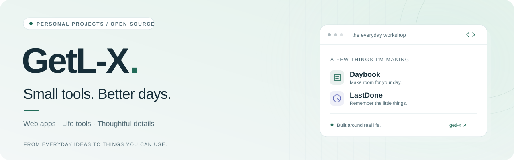

<picture>
  <source media="(prefers-color-scheme: dark)" srcset="assets/header-dark.svg">
  <source media="(prefers-color-scheme: light)" srcset="assets/header-light.svg">
  
</picture>

<h2 align="center">把日常的小麻烦，做成好用的小工具。</h2>

  你好，我是 <strong>GetL-X</strong> 👋 
  从记录生活、整理信息，到追比赛、改善观影体验， 
  我喜欢从自己的实际需求出发，借助 AI 把想法做成可以用、也愿意一直用的作品。

  <a href="https://getl-x.github.io/tiny-site/">个人小站</a> ·
  <a href="https://getl-x.github.io/personal-daily/">今日知览</a> ·
  <a href="https://github.com/getl-x?tab=repositories">全部项目</a>

### 关注的方向

- **日常效率**：少一点重复操作，让记录、提醒和信息整理更轻松。
- **数据自主**：关注隐私、本地处理、离线体验与自托管。
- **使用体验**：在功能之外，也认真打磨界面、交互和部署文档。

### 一些作品

<!-- PROJECTS:START -->
<table>
  <tr>
    <td width="50%" valign="top">
       
      <h3><a href="https://github.com/getl-x/daybook">Daybook</a> · 日记</h3>
      
早上想想今天，白天随手记下，晚上回顾。用固定问题引导记录，把日记留在自己的服务器上。

      
引导式记录 · 离线草稿 · PWA / Android · 自托管

    </td>
    <td width="50%" valign="top">
       
      <h3><a href="https://github.com/getl-x/lastdone">LastDone</a> · 生活提醒</h3>
      
滤芯上次是什么时候换的？备份又该做了吗？记录那些不常发生、却容易忘记的事。

      
周期追踪 · 离线优先 · 多端同步 · 自托管

    </td>
  </tr>
  <tr>
    <td width="50%" valign="top">
       
      <h3><a href="https://github.com/getl-x/matchpoint">Matchpoint</a> · 赛点</h3>
      
把官方电竞赛程、晋级图和历史存档放在一起，方便追踪 CS2、无畏契约、英雄联盟与 Apex 赛事。

      
官方数据 · 晋级图 · 开赛提醒 · PWA

    </td>
    <td width="50%" valign="top">
       
      <h3><a href="https://github.com/getl-x/personal-daily">今日知览</a> · 信息日报</h3>
      
每天自动汇总科技、财经、科学、游戏与国内要闻，去重、分类，再整理成清爽的阅读页面。

      
公开信息源 · 自动更新 · 历史归档 · GitHub Pages

    </td>
  </tr>
  <tr>
    <td width="50%" valign="top">
       
      <h3><a href="https://github.com/getl-x/cozy-journal">Cozy Journal</a> · 手账主题</h3>
      
给 WordPress 加一点纸张、贴纸与手账的温度。布局、配色和写作体验，都可以按自己的喜好调整。

      
WordPress · 主题定制 · 前台写作 · 隐私默认

    </td>
    <td width="50%" valign="top">
       
      <h3><a href="https://github.com/getl-x/bilibili-audio-enhancer">B 站音频增强</a></h3>
      
让轻声说话听得清，让忽大忽小的声音更平稳。音频处理在浏览器本地完成。

      
油猴脚本 · Web Audio · 人声增强 · 动态音量

    </td>
  </tr>
  <tr>
    <td width="50%" valign="top">
       
      <h3><a href="https://github.com/getl-x/tiny-site">tiny-site</a></h3>
      
一个自动部署的极简个人主页、博客与文档示例

      
CSS

    </td>
    <td width="50%" valign="top"></td>
  </tr>
</table>
<!-- PROJECTS:END -->

### 项目里用到的技术

  
  
  
  
  
  
  
  
  

### 一起把工具变好用

如果某个项目刚好能帮到你，欢迎试用，也欢迎在对应仓库提 Issue，聊聊使用感受、遇到的问题或想要的功能。

---

  从一个自己的需求开始，做一个也能帮到别人的小工具。 
  Small tools. Better days.

